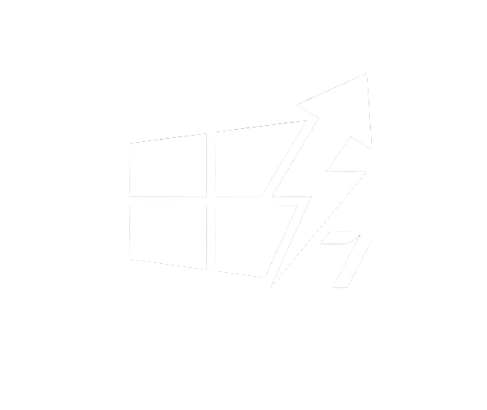
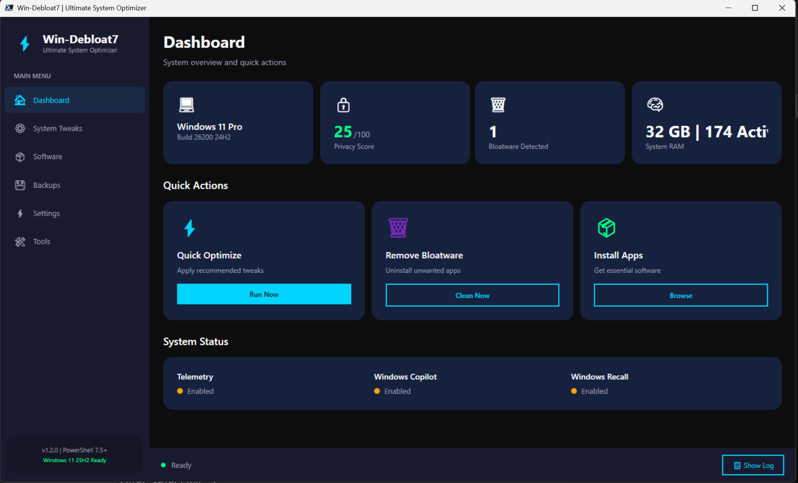
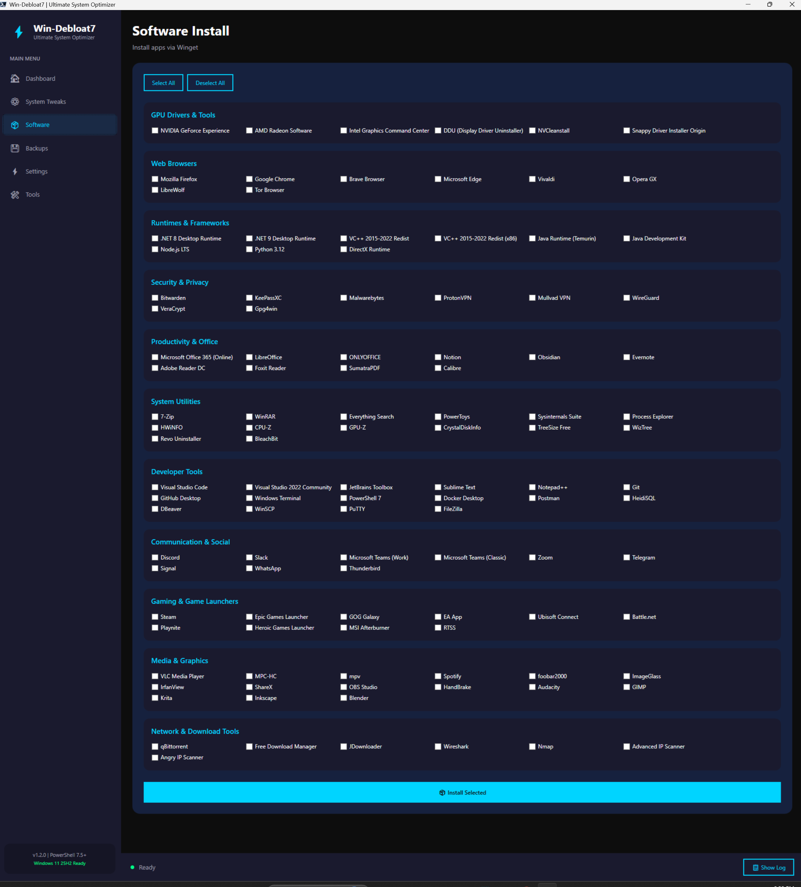

<div align="center">



# Win-Debloat7

### The Professional Windows Optimization Framework

[](https://github.com/tomytate/Win-Debloat7/releases)
[](https://winstall.app)
[](https://community.chocolatey.org/packages)
[](Dockerfile)
[](LICENSE)

**Modern • Modular • Reversible**

[Features](#-features) • [Install](#-installation) • [Benchmarks](#-benchmarks) • [Profiles](#-profiles) • [Wiki](https://github.com/tomytate/Win-Debloat7/wiki)

---


</div>

---

## 🎯 What is Win-Debloat7?

**Win-Debloat7** is a next-generation Windows optimization framework built from the ground up with **PowerShell 7.5**. Unlike legacy debloat scripts, Win-Debloat7 treats system configuration as **infrastructure-as-code** — using YAML profiles, encrypted snapshots, and real-time monitoring.

### Why Choose Win-Debloat7?

| Feature | Win-Debloat7 | Other Tools |
|---------|:------------:|:-----------:|
| **Real-time Telemetry Dashboard** | ✅ | ❌ |
| **YAML-based Profiles** | ✅ Infrastructure-as-Code | ❌ GUI only |
| **Encrypted Snapshots** | ✅ DPAPI | ⚠️ Basic/None |
| **Hardware Auto-Detection** | ✅ | ❌ |
| **PowerShell 7.5 Native** | ✅ CliXml / ArgumentCompleters | ⚠️ Legacy 5.1 |
| **Enterprise Ready** | ✅ | ⚠️ |
| **Full Rollback** | ✅ One-click restore | ⚠️ Partial |
| **25H2 / Copilot / Recall Ready** | ✅ | ⚠️ |

---

## ✨ Features

<table>
<tr>
<td width="50%">

### 🗑️ Intelligent Debloating
- Removes pre-installed bloat safely
- **Automatic snapshots** before changes
- Exclusion lists to protect apps you need
- Three modes: Conservative, Moderate, Aggressive

### 🔒 Privacy Hardening
- Block telemetry at DNS + firewall levels
- **GUI V2 Command Center** (5-Tab Layout)
- Disable **Copilot**, **Recall**, **Advertising ID**
- Multiple DNS providers (Cloudflare, Quad9, etc.)

</td>
<td width="50%">

### ⚡ Performance Optimization
- Hardware-aware profile auto-selection
- Gaming mode with low-latency tweaks
- Power plan management (Ultimate Performance)
- Benchmark before/after metrics

### 🛠️ Maintenance & Tools
- **New Tools Tab**: One-stop utility center
- **Driver Updates**: Winget & SDIO integration
- **System Repair**: One-click SFC/DISM fix
- **Network Reset**: Fix connectivity issues
- **UI Customization**: Taskbar & Context Menu tweaks

### 💾 System Snapshots
- **DPAPI-encrypted** state backups
- One-click rollback to any snapshot
- Automatic backup before every change
- **Bypasses 24h Creation Limit**

</td>
</tr>
</table>

### 📊 Unique: Real-Time Telemetry Monitor

Watch blocked connections **live** — visual proof your privacy is protected.

```
╔══════════════════════════════════════════════════════════════╗
║                 TELEMETRY MONITOR - LIVE                     ║
╠══════════════════════════════════════════════════════════════╣
║  Blocked: 247 connections | Saved: 12.4 MB bandwidth         ║
║  [████████████████░░░░] Telemetry: 82% blocked               ║
║  [██████████████████░░] Advertising: 91% blocked             ║
╚══════════════════════════════════════════════════════════════╝
```

---

## 📈 Benchmarks

Typical results on a fresh Windows 11 installation (Gaming Profile):

| Metric | Stock Windows 11 | Win-Debloat7 | Improvement |
| :--- | :--- | :--- | :--- |
| **Background Processes** | 145 | 82 | **-43%** |
| **RAM Usage (Idle)** | 4.2 GB | 2.8 GB | **-1.4 GB** |
| **Running Services** | 212 | 156 | **-56 Disabled** |
| **Telemetry Traffic** | Constant | 0 KB/s | **BLOCKED** |


## 📦 Installation

### Option 1: Winget (Recommended)
```powershell
winget install TomyTate.WinDebloat7
```

### Option 2: Chocolatey
```powershell
choco install win-debloat7
```

### Option 3: Standard Download (Recommended)
1. Download **Win-Debloat7-v1.2.0-Standard.zip** from [Releases](https://github.com/tomytate/Win-Debloat7/releases)
2. Extract the ZIP file
3. Open **PowerShell 7.5+** as Administrator
4. Run:
```powershell
cd path\to\Win-Debloat7
.\Win-Debloat7.ps1
```

### Requirements
- **Windows 10** 22H2+ or **Windows 11**
- **PowerShell 7.5** or higher ([Download](https://github.com/PowerShell/PowerShell/releases))
- **Administrator** privileges

> 💡 **Tip**: Windows Terminal is recommended for the best experience.

---

## 🚀 Why PowerShell 7.5?
Win-Debloat7 leverages specific features in the latest PowerShell release:
- **`ConvertTo-CliXml`**: Enables secure, in-memory encryption of system snapshots (no more plain-text exports).
- **Array Performance**: Uses the optimized `+=` operator (8x faster in 7.5) for cleaner code without performance penalty.
- **WebCmdlet Retries**: Native handling of HTTP 429/retries for reliable package downloads.

---

## 🚀 Quick Start

### Interactive Mode (GUI)
```powershell
.\Win-Debloat7.ps1
```
Select **Option 2** to launch the premium GUI.

### Profile Mode (Recommended)
```powershell
# Apply the moderate profile
.\Win-Debloat7.ps1 -ProfileFile "profiles\moderate.yaml"
```

### Unattended Mode (Automation)
```powershell
# No prompts, perfect for scripts
.\Win-Debloat7.ps1 -ProfileFile "profiles\gaming.yaml" -Unattended
```

### Module Mode (Advanced)
```powershell
Import-Module .\Win-Debloat7.psd1

# Use individual functions
$config = Import-WinDebloat7Config -Path "profiles\moderate.yaml"
Remove-WinDebloat7Bloatware -Config $config
Set-WinDebloat7Privacy -Config $config
```

---

## 📋 Profiles

Pre-configured optimization profiles for different use cases:

| Profile | Description | Best For |
|---------|-------------|----------|
| **Conservative** | Minimal changes, maximum safety | Cautious users, work PCs |
| **Moderate** | Balanced optimization | Most users ⭐ |
| **Gaming** | Maximum performance, aggressive debloat | Gamers, power users |
| **Essentials** | Post-debloat app installer | Fresh Windows installs |

### Create Your Own Profile

```yaml
# my-profile.yaml
metadata:
  name: "My Custom Profile"
  author: "Your Name"
  description: "Tailored for my setup"

bloatware:
  removal_mode: "Moderate"
  exclude_list:
    - "Microsoft.WindowsStore"
    - "Microsoft.XboxGamingOverlay"

privacy:
  telemetry_level: "Security"
  disable_copilot: true
  disable_recall: true

performance:
  power_plan: "Ultimate"
  disable_background_apps: true
```

---

## 🖥️ Screenshots

<div align="center">

| Dashboard | Privacy Settings | Software Installer |
|:---------:|:----------------:|:------------------:|
|  |  |  |

</div>

---

## 📖 Documentation

- **[📚 Full Wiki](https://github.com/tomytate/Win-Debloat7/wiki)** — Complete documentation
- **[🎥 Video Tutorial](https://youtube.com/@tomytate)** — Step-by-step walkthrough
- **[💬 Discussions](https://github.com/tomytate/Win-Debloat7/discussions)** — Ask questions, share profiles
- **[🐛 Report Bug](https://github.com/tomytate/Win-Debloat7/issues/new?template=bug_report.yml)**
- **[💡 Request Feature](https://github.com/tomytate/Win-Debloat7/issues/new?template=feature_request.yml)**

---

## 🤝 Contributing

Contributions are welcome! See **[CONTRIBUTING.md](CONTRIBUTING.md)** for:
- Code contribution guidelines
- Custom profile submissions
- Documentation improvements

---

## ⚖️ Standard vs Extras Edition

| | **Standard** ✅ | **Extras** ⚠️ |
|---|:---:|:---:|
| Core optimization | ✅ | ✅ |
| Privacy hardening | ✅ | ✅ |
| System snapshots | ✅ | ✅ |
| GUI + CLI | ✅ | ✅ |
| MAS (Activation) | ❌ | ⚠️ |
| Defender Remover | ❌ | ⚠️ |
| Antivirus flags | None | Likely |
| Recommended | **Yes** | Advanced only |

> ⚠️ **Extras edition** includes risky third-party tools. Use at your own risk. **Standard is recommended for 99% of users.**

---

## ⚠️ Disclaimer

Win-Debloat7 modifies Windows system settings. **Before using:**

- ✅ Create a **system restore point**
- ✅ **Backup** important data
- ✅ Test on a **non-production** system first
- ✅ Review profile settings before applying

**The authors are not responsible for any damage.** Use at your own risk.

---

## 📄 License

[MIT License](LICENSE) — Free for personal and commercial use.

---

## 🙏 Acknowledgments

- **PowerShell** community for amazing modules
- **Chris Titus Tech**, **WinUtil**, **LeDragoX** for inspiration
- All **[contributors](https://github.com/tomytate/Win-Debloat7/graphs/contributors)**

---

<div align="center">

**Made with ❤️ by [Tomy Tate](https://github.com/tomytate)**

⭐ **Star this repo** if Win-Debloat7 helped you!

[⬆ Back to Top](#win-debloat7)

</div>
