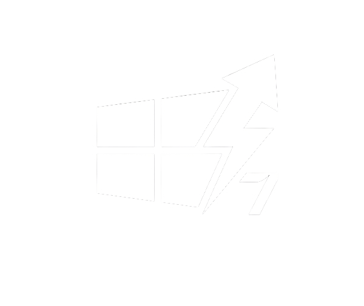
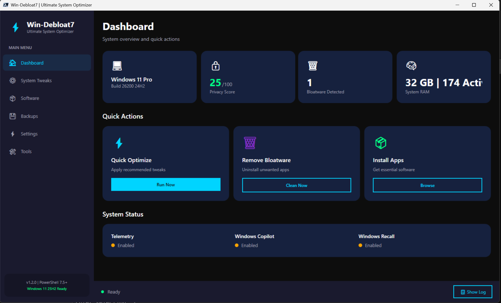

<div align="center">



# Win-Debloat7

### 🚀 The Ultimate Windows 10 & 11 Debloater, Optimizer & Privacy Hardener

**Remove bloatware · Kill telemetry & AI · Boost performance — reversible, in one command.**

*100% open source · DPAPI‑encrypted rollback · GUI + TUI · Built on PowerShell 7.6 LTS*

<br>

[](https://github.com/tomytate/Win-Debloat7/releases)
[](https://github.com/tomytate/Win-Debloat7/releases)
[](https://github.com/tomytate/Win-Debloat7/stargazers)
[](https://github.com/tomytate/Win-Debloat7)
[](https://github.com/PowerShell/PowerShell/releases)
[](LICENSE)
[](https://github.com/tomytate/Win-Debloat7/actions)

**[⚡ Install](#-quick-install) · [📖 Features](#-features-overview) · [🆚 Editions](#-editions-standard-vs-extras) · [🛡️ Safety](#-safety--encrypted-rollback) · [📚 Wiki](docs/Home.md) · [💬 Discuss](https://github.com/tomytate/Win-Debloat7/discussions)**

<br>

### ⭐ Reclaiming your PC? [**Star the repo**](https://github.com/tomytate/Win-Debloat7) — it takes 1 second and genuinely helps the project grow!

</div>

---

<p align="center">
  
</p>

---

## 📋 Table of Contents

- [What is Win-Debloat7?](#-what-is-win-debloat7)
- [Quick Install](#-quick-install)
- [Editions: Standard vs Extras](#-editions-standard-vs-extras)
- [Features Overview](#-features-overview)
- [Bloatware Removal](#-bloatware-removal)
- [Privacy & AI Disablement](#-privacy--ai-disablement)
- [Performance Optimization](#-performance-optimization)
- [Network & DNS Configuration](#-network--dns-configuration)
- [Software Installer & AI Tools](#-software-installer--ai-tools)
- [Windows 11 UI & System Customization](#-windows-11-ui--system-customization)
- [Enterprise Deployment (Sysprep)](#-enterprise-deployment--sysprep)
- [Safety & Rollback](#-safety--encrypted-rollback)
- [Why Win-Debloat7?](#-why-win-debloat7)
- [Trust & Verification](#-trust--verification)
- [FAQ](#-frequently-asked-questions)
- [Contributing](#-contributing)

---

## ⚡ What is Win-Debloat7?

**Win-Debloat7** is a professional-grade, open-source Windows debloating and optimization framework. It removes pre-installed bloatware, disables invasive telemetry and AI features, optimizes system performance, and hardens privacy — all with **one-click rollback** via encrypted snapshots.

Unlike legacy debloat scripts that blindly delete registry keys, Win-Debloat7 treats your system configuration **as code**. It uses audit-friendly YAML profiles, creates DPAPI-encrypted snapshots before every change, and exports structured logs for full transparency.

> **"It's like `terraform apply` for your Windows PC."**

### Key Stats (v1.3.1)

| Metric | Value |
|--------|-------|
| **Modules** | 29 registered |
| **Functions** | 115 exported (Standard) |
| **Bloatware Patterns** | 139 apps (tiered) |
| **DNS Providers** | 11 (including family/security variants) |
| **Service Presets** | 5 intelligent profiles |
| **Test Coverage** | Full Pester suite + PSScriptAnalyzer on every push (CI) |
| **PSScriptAnalyzer** | 0 errors |

---

## 🚀 Quick Install

Open **PowerShell as Administrator** and paste one command:

### Option A: Standard Edition (Recommended) 🛡️
Clean, open-source, no AV warnings. Safe for all environments.
```powershell
iwr -useb https://raw.githubusercontent.com/tomytate/Win-Debloat7/main/setup-standard.ps1 | iex
```

### Option B: Extras Edition (Advanced) ⚠️
Includes **Defender Remover** + **MAS**. Will trigger Antivirus warnings.
```powershell
iwr -useb https://raw.githubusercontent.com/tomytate/Win-Debloat7/main/setup-extras.ps1 | iex
```

<details>
<summary><b>📥 Alternative: Download Single-File EXE</b></summary>
<br>

1. Download from the **[Releases Page](https://github.com/tomytate/Win-Debloat7/releases)**:
   - **Win-Debloat7.exe** (Standard)
   - **Win-Debloat7-Extras.exe** (Extras)
2. Right-click → **Run as Administrator**.
3. The launcher verifies your PowerShell version and auto-installs PowerShell 7.6 LTS (currently 7.6.3) if missing or outdated.
</details>

<details>
<summary><b>🍫 Alternative: Chocolatey</b></summary>
<br>
<pre>choco install win-debloat7</pre>
</details>

<details>
<summary><b>🛠️ Alternative: Clone from Source</b></summary>
<br>
<pre>
git clone https://github.com/tomytate/Win-Debloat7.git
cd Win-Debloat7
.\Win-Debloat7.ps1
</pre>
</details>

**Requirements:** Windows 10 (22H2+) or Windows 11 · PowerShell 7.6+ LTS (auto-installed by the EXE) · Administrator privileges

---

## 🆚 Editions: Standard vs Extras

Both editions ship the **exact same** debloating, privacy, performance, and software engine. **Extras** simply bundles two powerful (but antivirus‑flagged) third‑party tools on top.

| Capability | 🛡️ **Standard** | ⚠️ **Extras** |
|:---|:---:|:---:|
| 🧹 Bloatware removal (139 tiered apps) | ✅ | ✅ |
| 🔒 Privacy hardening & telemetry blocking | ✅ | ✅ |
| 🤖 AI disablement (Copilot, Recall, Click‑to‑Do…) | ✅ | ✅ |
| ⚡ Performance, gaming & service tuning | ✅ | ✅ |
| 📦 Software installer (175 apps + AI CLIs) | ✅ | ✅ |
| 💾 Encrypted snapshots & one‑click rollback | ✅ | ✅ |
| 🖥️ GUI + TUI, YAML profiles, Sysprep | ✅ | ✅ |
| 🚫 **Defender Remover** — fully strip Windows Defender | — | ✅ |
| 🔑 **MAS** — activate Windows & Office (Microsoft Activation Scripts) | — | ✅ |
| 🛡️ Antivirus warnings | **None** ✅ | Expected ⚠️ |
| 👥 Recommended for | **Everyone** | Advanced users |

> **Which do I pick?** Go with **Standard** — it's clean, triggers zero AV warnings, and covers 99% of use cases. Choose **Extras** *only* if you specifically need to remove Windows Defender or activate Windows/Office. Extras is flagged by antivirus **by design**: Defender Remover and MAS are classified as "HackTools," so those alerts are expected, not malware.

---

## 📖 Features Overview

Win-Debloat7 ships with **115 functions** across **29 modules**, organized into 12 feature areas:

| Feature | Description | Key Functions |
|---------|-------------|---------------|
| 🧹 **Bloatware Removal** | Remove 139 tiered apps with O(N) regex | `Remove-WinDebloat7Bloatware` |
| 🔒 **Privacy Hardening** | Disable telemetry, block tracking domains | `Set-WinDebloat7Privacy` |
| 🤖 **AI Disablement** | Neutralize Copilot, Recall, Click-to-Do | `Disable-WinDebloat7AIRecall` |
| ⚡ **Performance Tuning** | Ultimate power plan, service presets | `Set-WinDebloat7Performance` |
| 🌐 **Network & DNS** | 11 DNS providers, IPv6 toggle | `Set-WinDebloat7DNS` |
| 🎮 **Gaming Mode** | Nagle's algorithm, Game DVR, GPU priority | `Set-WinDebloat7Gaming` |
| 📦 **Software Installer** | 175 curated apps (winget/choco/Store/npm) incl. AI CLIs | `Install-WinDebloat7Essentials` |
| 🖥️ **UI Customization** | Taskbar, context menu, Explorer, search, suggestions | `Set-WinDebloat7TaskbarTweaks` |
| 🧰 **System QoL** | Fast Startup, auto-BitLocker, Widgets, Storage Sense | `Disable-WinDebloat7WindowsSuggestions` |
| 🔧 **System Repair** | 4-step industrial repair sequence | `Repair-WinDebloat7System` |
| 🩺 **Live Dashboard** | Windows version, graded privacy score, live RAM | `Get-WinDebloat7PrivacyScore` |
| 🏢 **Enterprise (Sysprep)** | OEM image deployment, headless mode | `Invoke-WinDebloat7SysprepDefaults` |

---

## 🧹 Bloatware Removal

Removes pre-installed Appx packages using **O(N) regex matching** (50x faster than legacy nested-loop approaches).

### What Gets Removed

| Category | Examples |
|----------|---------|
| **Social Media** | Facebook, Instagram, Twitter/X, TikTok, LinkedIn |
| **Streaming** | Spotify, Netflix, Disney+, Prime Video, Pandora |
| **Casual Games** | Candy Crush, Bubble Witch, FarmVille, March of Empires |
| **Microsoft Bloat** | Get Started, Tips, Feedback Hub, Mixed Reality Portal, News |
| **OEM Bloatware** | HP Support Assistant, Dell SupportAssist, Lenovo Vantage, Acer Care Center |

### Removal Modes
- **Conservative**: Only sponsored/promo apps
- **Moderate**: Non-essential Microsoft apps (recommended)
- **Aggressive**: Everything except Store and Calculator
- **Custom**: Define your own list via YAML profile

### Advanced Removal
- **OneDrive**: Complete nuclear removal (all traces)
- **Microsoft Edge**: Force uninstall (WebView2 preserved)
- **Xbox**: Apps + services + Game Bar

---

## 🔒 Privacy & AI Disablement

### Telemetry Blocking
- **DiagTrack** service disabled (Connected User Experiences)
- **WaaSMedicSvc** neutralized
- **45 telemetry domains** blocked via Windows Defender Firewall (resolved to IPs)
- **Advertising ID** reset and disabled
- **Telemetry scheduled tasks** disabled

### Windows AI Disablement Suite
Completely neutralizes Microsoft's AI integration features added in Windows 11 22H2–25H2:

| Feature | Method | Function |
|---------|--------|----------|
| **Windows Recall** | Policy + Service | `Disable-WinDebloat7AIRecall` |
| **Copilot** | Taskbar + Policy + Win+C | `Disable-WinDebloat7Copilot` |
| **Click-to-Do** | Registry override | `Disable-WinDebloat7ClickToDo` |
| **Notepad AI** | Feature flag | `Disable-WinDebloat7NotepadAI` |
| **Paint AI** | Feature flag | `Disable-WinDebloat7PaintAI` |
| **Edge AI** | Policy override | `Disable-WinDebloat7EdgeAI` |

---

## ⚡ Performance Optimization

### Power Management
- **Ultimate Performance**: Unlock and activate the hidden power plan
- **Plan Duplication**: Clone the plan for custom modifications

### Service Optimization
5 intelligent presets driven by `config/services.json`:

| Preset | Purpose | Services Affected |
|--------|---------|-------------------|
| **Privacy** | Disable telemetry services | DiagTrack, dmwappushservice, WaaSMedicSvc |
| **Performance** | Disable background services | SysMain, WSearch, Fax, PrintWorkflow |
| **Security** | Harden attack surface | RemoteRegistry, SMB1, NetBIOS |
| **Minimal** | Bare essentials only | RetailDemo, Fax, WMPNetworkSvc, AJRouter |
| **Gaming** | Trim Xbox services (non-gamers) | XblAuthManager, XblGameSave, XboxNetApiSvc |

### Gaming Tweaks
- Disable **Nagle's Algorithm** (TCPNoDelay = 1)
- Optimize **MMCSS Scheduling** (SystemResponsiveness = 0)
- Disable **Game DVR / Game Bar** background recording
- GPU task **priority elevation**
- **Network latency** optimization

---

## 🌐 Network & DNS Configuration

Set your DNS provider in one command. Full database stored in `config/dns.json`.

| Provider | Primary | Secondary | Type |
|----------|---------|-----------|------|
| Cloudflare | 1.1.1.1 | 1.0.0.1 | Standard |
| Cloudflare Malware | 1.1.1.2 | 1.0.0.2 | Security |
| Cloudflare Family | 1.1.1.3 | 1.0.0.3 | Family Safe |
| Google | 8.8.8.8 | 8.8.4.4 | Standard |
| OpenDNS | 208.67.222.222 | 208.67.220.220 | Standard (Cisco) |
| Quad9 | 9.9.9.9 | 149.112.112.112 | Security |
| NextDNS | 45.90.28.0 | 45.90.30.0 | Customizable |
| AdGuard | 94.140.14.14 | 94.140.15.15 | Ad Blocking |
| AdGuard Family | 94.140.14.15 | 94.140.15.16 | Family Safe |
| CleanBrowsing Security | 185.228.168.9 | 185.228.169.9 | Security |
| CleanBrowsing Family | 185.228.168.168 | 185.228.169.168 | Family Safe |

```powershell
# Set Cloudflare DNS
Set-WinDebloat7DNS -Provider Cloudflare

# Set OpenDNS
Set-WinDebloat7DNS -Provider OpenDNS

# Set custom DNS
Set-WinDebloat7DNS -Provider Custom -CustomPrimary "1.2.3.4" -CustomSecondary "5.6.7.8"
```

---

## 📦 Software Installer & AI Tools

A curated catalog of **175 apps** across **12 categories**, installable from the GUI (live search) or TUI. Every package ID is validated against live sources, and a monthly CI job re-checks them so nothing rots. Each app can install via **winget → Chocolatey → Microsoft Store → npm**, whichever channel actually carries it — with automatic fallback and package-manager provisioning.

Includes a dedicated **AI Assistants & CLIs** category:

| Type | Apps |
|------|------|
| **AI CLIs** | Claude Code, Gemini CLI, OpenAI Codex, GitHub Copilot CLI |
| **Desktop assistants** | Claude Desktop, ChatGPT, Microsoft Copilot, Perplexity (+ Comet browser) |
| **Multi-model / local LLMs** | Cherry Studio, Chatbox, Msty, Ollama, LM Studio, Jan, GPT4All |

```powershell
# Install a whole category, or specific apps
Install-WinDebloat7Essentials -Categories AITools, DevTools

# Profiles can install AND uninstall software
software:
  install_list:   [ "Anthropic.ClaudeCode", "Mozilla.Firefox" ]
  uninstall_list: [ "Microsoft.Teams" ]
```

---

## 🖥️ Windows 11 UI & System Customization

| Tweak | Function | Options |
|-------|----------|---------|
| **Taskbar** | `Set-WinDebloat7TaskbarAlignment` / `Set-WinDebloat7TaskbarTweaks` | Alignment, search modes, Task View, Widgets, Chat, End Task |
| **Context Menu** | `Set-WinDebloat7ContextMenu` / `Set-WinDebloat7ContextMenuItems` | Classic/Modern, remove Share / Give access / Include in library |
| **Explorer** | `Set-WinDebloat7Explorer` | Hide Gallery/Home/OneDrive, show extensions & hidden files, landing page |
| **Search** | `Set-WinDebloat7Search` | Remove Bing/Cortana, Search Highlights, history |
| **Suggestions & Ads** | `Disable-WinDebloat7WindowsSuggestions` | Kill Start/Settings/lock-screen suggestions, promoted-app installs |
| **System QoL** | `Disable-WinDebloat7FastStartup` … | Fast Startup, auto-BitLocker, Delivery Optimization, Storage Sense, transparency, Snap Assist |
| **Desktop/Settings Ads** | `Disable-WinDebloat7DesktopSpotlight` | Remove Spotlight & M365 promotions |

---

## 🏢 Enterprise Deployment & Sysprep

Deploy Win-Debloat7 at scale with **Infrastructure as Code**:

```yaml
# my-baseline.yaml
metadata:
  name: "Corporate Workstation"
  version: 1.0
bloatware:
  removal_mode: "Moderate"
  exclude_list:
    - "Microsoft.WindowsStore"
    - "Microsoft.WindowsCalculator"
privacy:
  telemetry_level: "Security"
  disable_copilot: true
  disable_recall: true
performance:
  power_plan: "Ultimate"
```

```powershell
# Headless deployment (for RMM tools like Intune, SCCM, PDQ)
./Win-Debloat7.exe -ProfileFile my-baseline.yaml -Unattended
```

### Sysprep / OEM Support
Apply tweaks to the **Default User** registry hive so settings persist for all future user profiles:

```powershell
Invoke-WinDebloat7SysprepDefaults
```

---

## 🛡️ Safety & Encrypted Rollback

We know debloating can be risky. Win-Debloat7 is built with **enterprise-grade safety rails**:

| Feature | Description |
|---------|-------------|
| **Encrypted Snapshots** | DPAPI-encrypted system state backup before every change |
| **One-Click Rollback** | Restore exact registry + service state from the GUI |
| **Bypass 24h Limit** | Creates snapshots without the Windows "1 per day" restriction |
| **Non-Destructive** | Standard edition never touches Store/Update unless explicitly asked |
| **Structured Logs** | Every action logged to `C:\ProgramData\Win-Debloat7\Logs` |
| **CI Verified** | Pester suite + PSScriptAnalyzer run on every push |

---

## 💎 Why Win-Debloat7?

<table>
<tr>
<td width="50%" valign="top">

**🔐 Reversible by design**
Every change is preceded by a DPAPI‑encrypted snapshot. One click restores your exact previous state — debloat fearlessly.

**📜 Configuration as code**
Define your ideal setup once in a YAML profile, then version it, share it, and redeploy it on any machine. It's `terraform apply` for Windows.

**🤖 Actually removes AI**
Copilot, Recall, Click‑to‑Do, and Notepad/Paint/Edge AI — neutralized through Group Policy, not flimsy UI toggles that Windows re‑enables.

</td>
<td width="50%" valign="top">

**🖥️ GUI *and* TUI**
A polished dark‑mode dashboard for clicking, plus a fast terminal menu for power users — identical capabilities, your choice.

**🏢 Enterprise‑ready**
Headless `-Unattended` deploys for Intune / SCCM / PDQ, and Sysprep support to bake settings into OEM images for every future user.

**🧪 Transparent & trusted**
100% open PowerShell — the Standard edition has **zero** compiled binaries. Every push is verified by Pester + PSScriptAnalyzer in CI.

</td>
</tr>
</table>

---

## 🔒 Trust & Verification

### Before You Run Any Debloat Tool (Including Ours):

1. ✅ **Verify the source**: Only download from [github.com/tomytate/Win-Debloat7/releases](https://github.com/tomytate/Win-Debloat7/releases).
2. ✅ **Check SHA256 hashes**: Every release includes checksums in the Release Notes.
3. ✅ **Understand Standard vs Extras**:
   - **Standard** (`Win-Debloat7.exe`): Clean code, no AV warnings.
   - **Extras** (`Win-Debloat7-Extras.exe`): Contains Defender Remover + MAS → **Expected** AV flags.

### Transparency Promise

- 🔓 **100% Open Source**: No compiled binaries in Standard edition.
- 📋 **Structured Logs**: Every action logged with timestamps and severity levels.
- 🔐 **Encrypted Snapshots**: Rollback state stored with Windows DPAPI.
- 🧪 **Verified**: Pester compliance suite + PSScriptAnalyzer (0 errors) enforced by CI.

> **If Standard Edition triggers AV warnings, [report it immediately](https://github.com/tomytate/Win-Debloat7/issues) as a false positive.**

---

## ❓ Frequently Asked Questions

<details>
<summary><b>Is Win-Debloat7 safe to use?</b></summary>
<br>
Yes. The Standard edition uses only official PowerShell APIs and Group Policy modifications. Every change creates an encrypted snapshot for instant rollback. The codebase is verified by a Pester compliance suite and PSScriptAnalyzer in CI.
</details>

<details>
<summary><b>Will this break Windows Update or Microsoft Store?</b></summary>
<br>
No, not with default settings. The Standard edition never touches Windows Update or Microsoft Store unless you explicitly configure it in your YAML profile. If you use Aggressive bloatware removal, Store components may be affected — use the snapshot rollback to restore.
</details>

<details>
<summary><b>Why does the Extras edition trigger my antivirus?</b></summary>
<br>
The Extras edition includes <b>Defender Remover</b> and <b>MAS</b> (Microsoft Activation Scripts). These tools modify Windows security components and are intentionally flagged as "HackTools" by antivirus software. This is expected. Use the Standard edition if you want zero AV warnings.
</details>

<details>
<summary><b>Does Win-Debloat7 work on Windows 10?</b></summary>
<br>
Yes. Win-Debloat7 supports Windows 10 (22H2+) and Windows 11 (all versions through 25H2). Some features (like AI disablement and Taskbar alignment) are Windows 11–specific.
</details>

<details>
<summary><b>Can I use this in an enterprise / Intune / SCCM deployment?</b></summary>
<br>
Yes. Use <code>-ProfileFile config.yaml -Unattended</code> for headless deployment via any RMM tool. The Sysprep module (<code>Invoke-WinDebloat7SysprepDefaults</code>) applies settings to the Default User hive for OEM image preparation.
</details>

<details>
<summary><b>How do I undo changes?</b></summary>
<br>
Open the GUI → Restore tab → select the pre-change snapshot → click Restore. Or via CLI: <code>Restore-WinDebloat7Snapshot -Name "snapshot-name"</code>.
</details>

---

## 🤝 Contributing

We welcome contributions! See [CONTRIBUTING.md](CONTRIBUTING.md) for guidelines.

```powershell
# Clone and run tests
git clone https://github.com/tomytate/Win-Debloat7.git
cd Win-Debloat7
Invoke-Pester -Path tests/Overall.Tests.ps1 -Output Detailed
```

---

## 📈 Star History

<div align="center">

<a href="https://star-history.com/#tomytate/Win-Debloat7&Date">
  
</a>

</div>

---

<div align="center">

### ⚡ Ready to Reclaim Your PC?

```powershell
iwr -useb https://raw.githubusercontent.com/tomytate/Win-Debloat7/main/setup-standard.ps1 | iex
```

**[📥 Download](https://github.com/tomytate/Win-Debloat7/releases) · [📖 Wiki](docs/Home.md) · [💬 Discussions](https://github.com/tomytate/Win-Debloat7/discussions) · [🔐 Security](SECURITY.md)**

<br>

### ⭐ If Win-Debloat7 gave you a faster, cleaner, more private PC — [**drop a star!**](https://github.com/tomytate/Win-Debloat7) ⭐

It costs nothing, motivates development, and helps other users find the project.

<br>

Made with ⚡ by **[Tomy Tate](https://github.com/tomytate)** · Licensed under **[MIT](LICENSE)**

<sub><a href="#win-debloat7">↑ Back to top</a></sub>

*Enjoy a faster, cleaner, more private Windows experience.*

</div>
